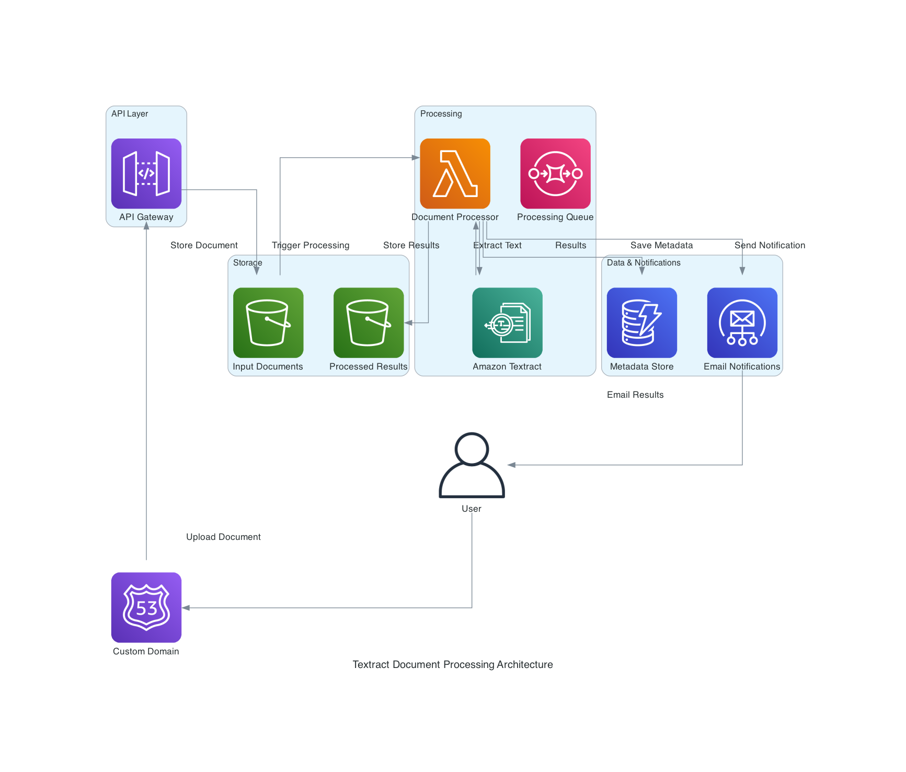

# AWS Textract PDF Processing PoC

This Terraform configuration deploys a serverless architecture for processing PDF files via email using AWS Textract and LLM integration.

## Architecture Overview



The architecture implements a complete email-to-processing pipeline:

1. **Email Ingestion**: User sends email with PDF attachment to SES
2. **Email Storage**: SES stores raw email in S3 `emails/` folder
3. **PDF Extraction**: Email Processor Lambda extracts PDF attachments
4. **PDF Storage**: PDFs saved to S3 `incoming/` folder
5. **Document Processing**: Textract Processor Lambda triggered by S3 event
6. **Text Extraction**: Amazon Textract extracts text from PDF
7. **LLM Integration**: Extracted text sent to external LLM API for processing
8. **Results Storage**: JSON outputs and LLM responses stored in S3 `processed/` folder
9. **Monitoring**: CloudWatch logs all processing steps
10. **Error Handling**: Failed processes sent to SQS Dead Letter Queue

## Project Structure

```
├── terraform/              # Terraform infrastructure code
│   ├── main.tf
│   ├── variables.tf
│   ├── outputs.tf
│   ├── route53-domain.tf
│   ├── ses-email-setup.tf
│   ├── terraform.tfvars.example
│   └── .terraform/
├── src/                    # Source code
│   └── lambda/
│       ├── email_processor.py
│       └── lambda_function.py
├── docs/                   # Documentation
│   ├── assets/            # Images and diagrams
│   └── EMAIL_SETUP.md
├── scripts/               # Utility scripts
│   └── create_test_pdf.py
├── tests/                 # Test files and data
├── build/                 # Build artifacts (zip files)
└── .amazonq/             # Amazon Q configuration
```

## Components

- **S3 Bucket**: Stores incoming PDFs and processed JSON files
- **Lambda Function**: Orchestrates Textract processing and LLM API calls
- **Amazon Textract**: Extracts text from PDF documents
- **Secrets Manager**: Securely stores LLM API credentials
- **CloudWatch**: Logging and monitoring
- **SQS**: Dead letter queue for error handling

## Prerequisites

1. AWS CLI configured with appropriate credentials
2. Terraform >= 1.0 installed
3. LLM API endpoint and key

## Deployment

1. **Navigate to terraform directory**:
   ```bash
   cd terraform/
   ```

2. **Configure variables** (optional):
   ```bash
   cp terraform.tfvars.example terraform.tfvars
   # Edit terraform.tfvars with your values
   ```

3. **Deploy infrastructure**:
   ```bash
   terraform init
   terraform plan
   terraform apply
   ```

4. **Update API credentials**:
   ```bash
   aws secretsmanager update-secret --secret-id textract-poc-llm-api-key \
     --secret-string '{"api_key":"your-actual-api-key","api_url":"https://your-api-endpoint.com/v1/chat"}'
   ```

## Usage

### Email-Based Processing (Primary Workflow)

#### Option 1: Register New Domain via Route 53 (Recommended for PoC)

1. **Configure Domain Registration** (before deployment):
   ```bash
   cd terraform/
   cp terraform.tfvars.example terraform.tfvars
   # Edit terraform.tfvars and set:
   register_new_domain = true
   new_domain_name = "textract-poc-demo.com"  # Choose available domain
   ses_email_address = "documents@textract-poc-demo.com"
   
   # Update contact information with your real details:
   domain_contact_email = "your-email@example.com"
   domain_contact_first_name = "Your Name"
   # ... other contact fields
   ```

2. **Deploy Infrastructure**:
   ```bash
   terraform init
   terraform apply
   # Domain registration may take 15-30 minutes
   # DNS records are automatically configured
   ```

3. **Wait for Domain Propagation** (15-30 minutes):
   - Domain registration completes automatically
   - DNS records are automatically created in Route 53
   - SES domain verification happens automatically

4. **Send Email with PDF Attachment**:
   ```
   To: documents@textract-poc-demo.com  # Your new domain email
   Subject: Process this document
   Attachment: document.pdf
   ```

#### Option 2: Use Existing Domain

1. **Configure Existing Domain**:
   ```bash
   cd terraform/
   cp terraform.tfvars.example terraform.tfvars
   # Edit terraform.tfvars and set:
   register_new_domain = false
   ses_domain = "yourdomain.com"
   ses_email_address = "documents@yourdomain.com"
   ```

2. **Deploy Infrastructure**:
   ```bash
   terraform apply
   # Note the DNS configuration outputs
   ```

3. **Configure DNS Records** (in your domain provider):
   - **Domain Verification**: Add TXT record with verification token from terraform output
   - **DKIM Authentication**: Add CNAME records for DKIM tokens from terraform output  
   - **MX Record**: Point to your AWS region's SES endpoint

#### Automatic Processing Flow (Both Options):
- SES receives email → stores in S3 `emails/` folder
- Email Processor Lambda extracts PDF → saves to `incoming/` folder  
- Textract Processor Lambda processes PDF → creates JSON → calls LLM API
- Results stored in `processed/` folder

### Manual Testing (Alternative)

1. **Upload PDF files** directly to S3 for testing:
   ```bash
   aws s3 cp document.pdf s3://your-bucket-name/incoming/document.pdf
   ```

2. **Monitor processing** via CloudWatch logs:
   ```bash
   aws logs tail /aws/lambda/textract-poc-textract-processor --follow
   aws logs tail /aws/lambda/textract-poc-email-processor --follow
   ```

3. **Check results** in the `processed/` prefix of the S3 bucket

## S3 Bucket Structure

```
emails/             # Raw emails from SES
├── email1.txt
└── email2.txt

metadata/           # Email metadata
├── email1_metadata.json
└── email2_metadata.json

incoming/           # Extracted PDFs ready for processing
├── abc12345_document1.pdf
└── def67890_document2.pdf

processed/          # JSON outputs from Textract
├── abc12345_document1.json
├── abc12345_document1_llm_response.json
├── def67890_document2.json
└── def67890_document2_llm_response.json
```

## Configuration

### Environment Variables (Lambda)
- `BUCKET_NAME`: S3 bucket name
- `API_SECRET_NAME`: Secrets Manager secret name

### Terraform Variables
- `aws_region`: AWS region (default: us-east-1)
- `project_name`: Resource name prefix (default: textract-poc)
- `llm_api_key`: LLM API key (sensitive)
- `llm_api_url`: LLM API endpoint URL

## Security Features

- S3 server-side encryption (AES256)
- IAM roles with least-privilege permissions
- API credentials stored in AWS Secrets Manager
- VPC endpoints support (if needed)

## Monitoring

- CloudWatch logs for Lambda execution
- S3 access logging
- Dead letter queue for failed processing
- 7-day lifecycle policy for cost optimization

## Troubleshooting

1. **Check Lambda logs**:
   ```bash
   aws logs describe-log-groups --log-group-name-prefix "/aws/lambda/textract-poc"
   ```

2. **Verify S3 permissions**:
   ```bash
   aws s3 ls s3://your-bucket-name/
   ```

3. **Test Textract access**:
   ```bash
   aws textract detect-document-text --document '{"S3Object":{"Bucket":"your-bucket","Name":"incoming/test.pdf"}}'
   ```

## Cost Optimization

- 7-day S3 lifecycle policy
- Lambda timeout set to 5 minutes
- CloudWatch log retention: 14 days
- Free tier eligible for small workloads

## Cleanup

```bash
cd terraform/
terraform destroy
```

## Next Steps for Production

1. Add SES email domain configuration
2. Implement email parsing for attachments
3. Add API Gateway for webhook integration
4. Configure VPC for enhanced security
5. Add monitoring dashboards
6. Implement backup and disaster recovery